# 🌱 Parivartan

## ♻️ Smart Waste Management & Recycling Ecosystem

Parivartan is an AI-powered waste management platform designed to transform the way waste is identified, segregated, collected, and recycled. The platform connects citizens, recycling partners, NGOs, startups, self-help groups, and government-supported initiatives through a unified digital ecosystem.

By leveraging AI-powered waste detection, smart recycler matching, pickup scheduling, community engagement, rewards, and impact tracking, Parivartan promotes responsible waste disposal while encouraging citizen participation in environmental sustainability.

Our mission is to reduce improper waste disposal, increase recycling efficiency, and create a cleaner, greener, and more sustainable future.

---

# 🚀 Project Poster

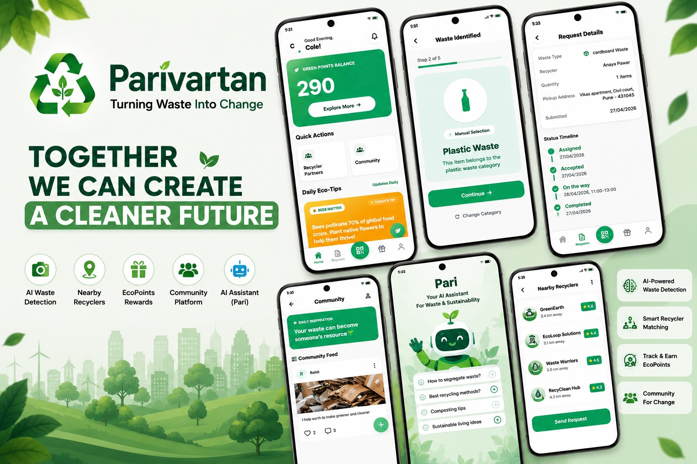

---

# 🎯 Sustainable Development Goals

Parivartan directly contributes towards the following United Nations Sustainable Development Goals.

<table align="center">
<tr>

<td align="center">
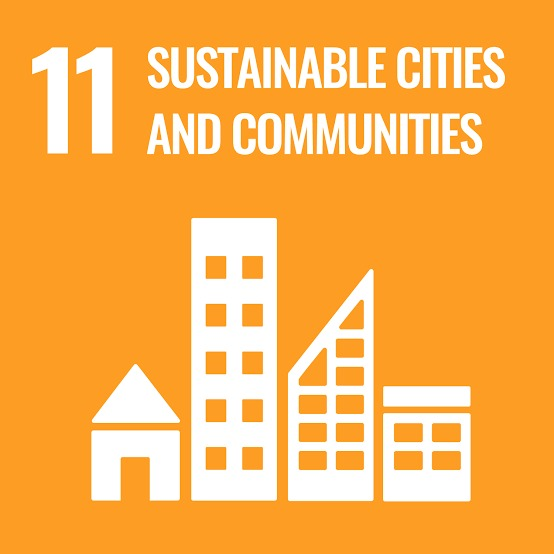 

### SDG 11
### Sustainable Cities and Communities

Making cities cleaner, safer, and environmentally sustainable through responsible waste management.

</td>

<td align="center">
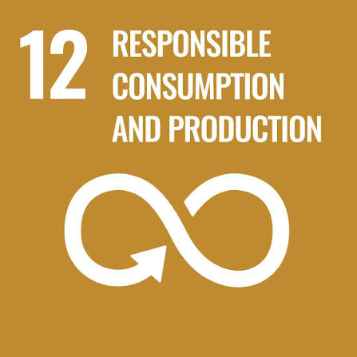 

### SDG 12
### Responsible Consumption and Production

Promoting waste segregation, recycling, and efficient utilization of resources.

</td>

<td align="center">
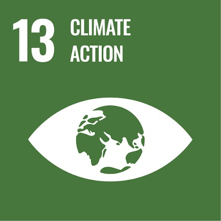 

### SDG 13
### Climate Action

Reducing environmental pollution and carbon emissions through sustainable waste practices.

</td>

</tr>
</table>

---

# ❗ Problem Statement

Improper waste segregation remains one of the major environmental challenges across rural, urban, and semi-urban areas.

Large quantities of plastic, paper, cardboard, metal, cloth, organic waste, and electronic waste are mixed together and disposed of without proper segregation. Due to the lack of awareness, organized collection systems, and efficient recycling channels, valuable recyclable materials often end up in landfills or are burned, resulting in environmental pollution and health hazards.

Meanwhile, NGOs, recycling startups, artisans, self-help groups, and government-supported initiatives actively seek recyclable materials but face difficulties in sourcing them efficiently.

This gap between waste generation and waste utilization leads to:

- Poor waste segregation
- Environmental pollution
- Open waste burning
- Resource wastage
- Reduced recycling efficiency
- Missed economic opportunities
- Increased carbon footprint

There is a need for an intelligent platform that connects waste generators with verified recyclers while encouraging responsible waste disposal practices.

---

# 📊 Survey & Research

Before developing Parivartan, extensive research and surveys were conducted to understand waste management challenges faced by communities and recycling stakeholders.

<table>
<tr>

<td align="center">
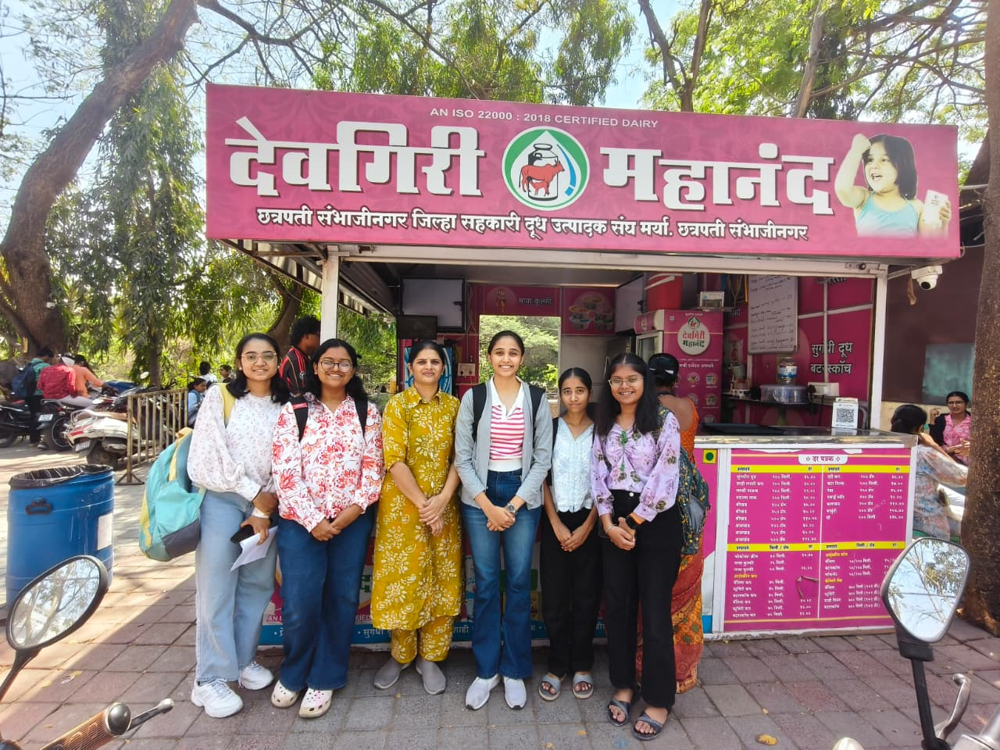 

### Community Survey

Understanding public awareness regarding waste segregation and recycling.

</td>

<td align="center">
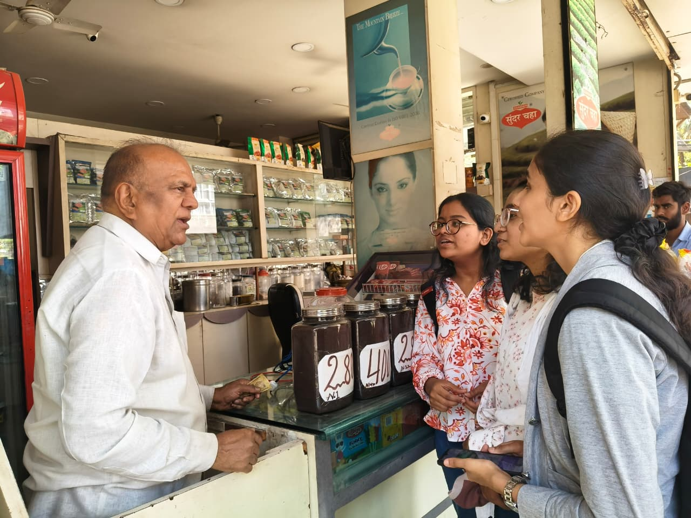 

### Problem Analysis

Identifying major challenges in waste collection, segregation, and recycling.

</td>

</tr>
</table>

## 📌 Key Findings

- Most households do not segregate waste before disposal.
- Citizens are unaware of nearby recycling facilities.
- Waste burning remains common in several areas.
- Recyclers face challenges sourcing categorized waste.
- Communities are willing to participate if rewards and incentives are provided.
- Technology can significantly improve waste collection efficiency.

The findings validated the need for a technology-driven waste management ecosystem like Parivartan.

---

# 💡 Proposed Solution

Parivartan provides an intelligent and scalable waste management platform that connects waste generators with verified recycling partners.

The platform enables users to upload waste images, identify waste categories, schedule pickups, track requests, and earn rewards for responsible waste disposal.

Through AI-powered automation and recycler connectivity, Parivartan simplifies the recycling process while creating environmental and social impact.

### Core Stakeholders

#### 👤 Citizens
Households and small-scale waste generators responsible for waste disposal.

#### ♻️ Recycling Partners
NGOs, recyclers, startups, artisans, and government-supported organizations involved in waste processing.

#### 🛡️ Admin
Responsible for verification, monitoring, analytics, moderation, and platform management.

---

# 🚀 Key Features

<table>
<tr>

<td align="center" width="33%">

### 🤖 AI Waste Detection

AI identifies waste type and category from uploaded images with high accuracy.

</td>

<td align="center" width="33%">

### 📸 Waste Image Upload

Upload waste images through mobile app or website for instant analysis.

</td>

<td align="center" width="33%">

### ♻️ Smart Recycler Matching

Connects users with verified recyclers based on waste type and location.

</td>

</tr>

<tr>

<td align="center">

### 📅 Pickup Scheduling

Schedule waste collection requests with flexible timings.

</td>

<td align="center">

### 🌍 Multi-Language Support

Supports multiple regional languages for better accessibility.

</td>

<td align="center">

### 💬 AI Chatbot Assistant

24/7 assistant providing waste segregation and recycling guidance.

</td>

</tr>

<tr>

<td align="center">

### 🌱 Community Platform

Share recycling activities, awareness campaigns, and sustainability initiatives.

</td>

<td align="center">

### 🎁 Rewards & EcoPoints

Earn EcoPoints for responsible waste disposal and redeem exciting rewards.

</td>

<td align="center">

### 📊 Impact Tracking

Track waste diverted, CO₂ reduction, and environmental contribution.

</td>

</tr>

<tr>

<td align="center">

### ✅ Verified Recycler Network

Verified recyclers ensure reliability, transparency, and trust.

</td>

<td align="center">

### 📈 Admin Dashboard Analytics

Monitor users, recyclers, pickups, rewards, and platform performance.

</td>

<td align="center">

### 🚚 Real-Time Monitoring

Track collection requests and waste processing activities in real time.

</td>

</tr>

</table>

---

# 🏗️ System Architecture

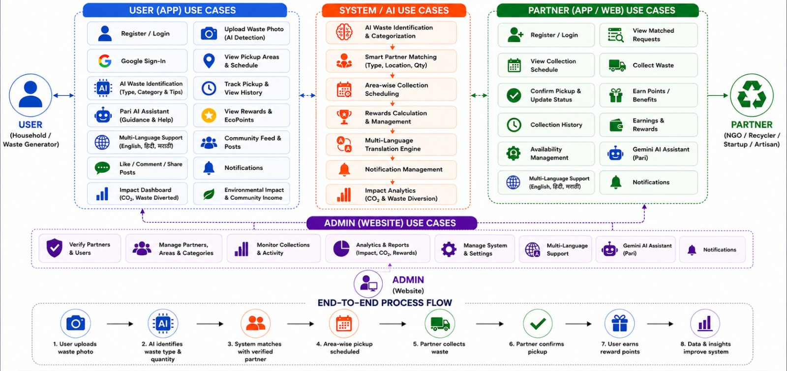

### Architecture Overview

The Parivartan ecosystem consists of three primary stakeholders:

- Citizens generating waste
- Verified recycling partners
- Platform administrators

The system integrates AI-based waste classification, recycler connectivity, pickup scheduling, community engagement, rewards, analytics, and monitoring into a unified platform.

---

# ⚙️ Workflow

# 📱 Mobile Application Workflow

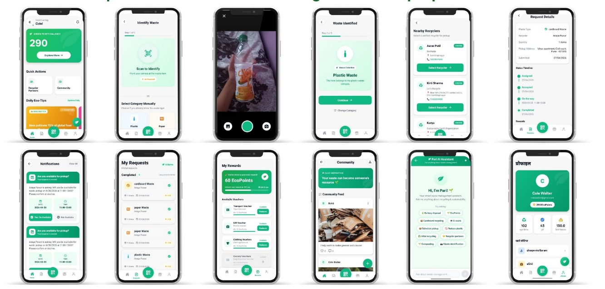

### Mobile Application Flow

#### 🔐 Authentication
- User Registration
- Login
- Profile Management

#### 📸 Waste Detection
- Upload Waste Image
- Camera-Based Detection
- AI Classification

#### ♻️ Recycler Matching
- View Nearby Recyclers
- Recycler Details
- Recycler Selection

#### 📅 Pickup Scheduling
- Create Pickup Request
- Select Date & Time
- Confirm Collection

#### 🎁 Rewards System
- Earn EcoPoints
- View Reward History
- Redeem Rewards

#### 🌱 Community Platform
- Create Posts
- Like & Comment
- Awareness Campaigns

#### 💬 AI Assistant
- Waste Segregation Guidance
- Recycling Recommendations
- User Support

#### 📊 Impact Tracking
- Waste Recycled
- Environmental Contribution
- Sustainability Metrics

# 💻 Web Platform Workflow

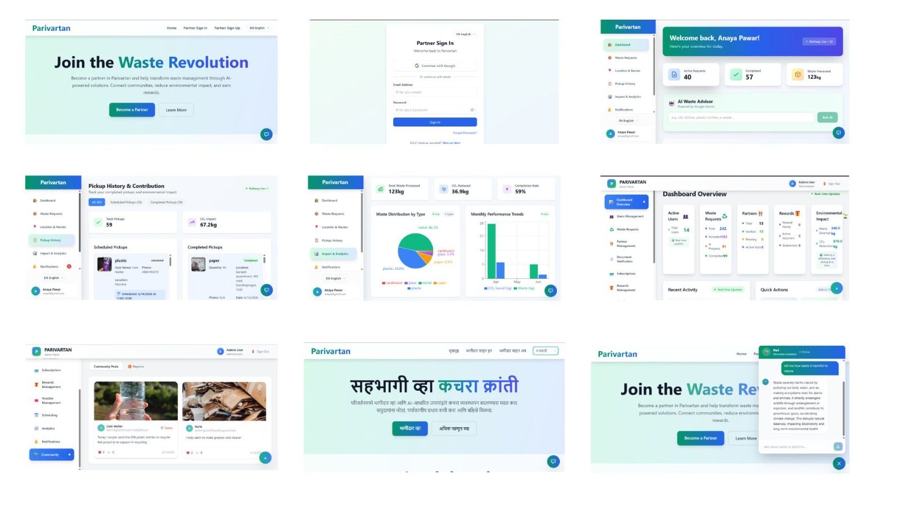

### Website Platform Flow

#### ♻️ Recycler Dashboard
- View Collection Requests
- Accept or Reject Requests
- Track Collection Activities

#### 📋 Request Management
- Monitor Active Requests
- View Collection History
- Update Request Status

#### 📊 Analytics Dashboard
- Waste Collection Statistics
- Environmental Impact Metrics
- User Engagement Insights

#### 🌍 Community Moderation
- Review Community Posts
- Remove Inappropriate Content
- Monitor Platform Activities

#### ✅ Recycler Verification
- Verify New Partners
- Approve Recycling Organizations
- Manage Recycler Profiles

#### 🛡️ Admin Controls
- User Management
- Reward Management
- Platform Monitoring

#### 🤖 AI Integration
- Waste Classification Monitoring
- Chatbot Assistance
- Analytics Support

---

# 📈 Feedback & Impact Analysis

To validate the effectiveness of Parivartan, we conducted surveys and collected feedback from students, households, environmental enthusiasts, and community members.

<table>
<tr>

<td align="center">
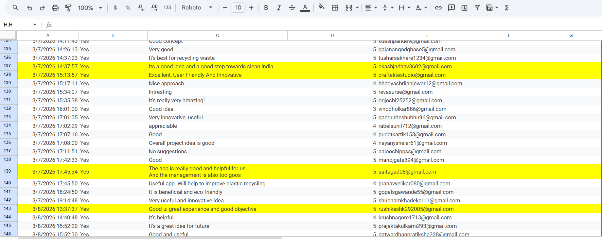 

### 📝 Community Survey Responses

Real feedback collected from users regarding waste segregation, recycling challenges, and platform usability.

</td>

<td align="center">
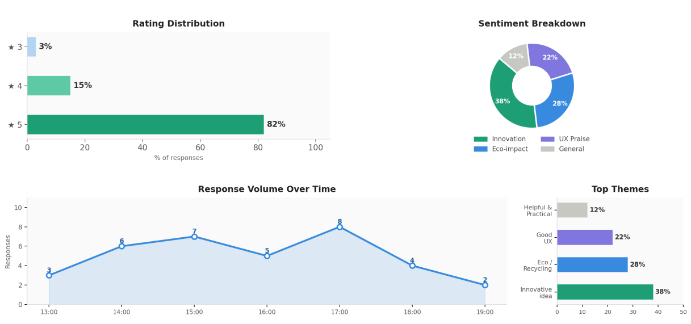 

### 📊 Visual Feedback Analysis

Graphical representation of survey results, user ratings, and community acceptance of the platform.

</td>

</tr>
</table>

---

## 📌 Key Insights

✅ Majority of respondents agreed that improper waste segregation is a major issue.

✅ Users showed strong interest in AI-based waste identification.

✅ Citizens preferred scheduled waste collection over individual pickups.

✅ Reward-based recycling received highly positive responses.

✅ Most participants believed technology can improve waste management efficiency.

✅ Strong support was observed for connecting households directly with verified recyclers.

---

## 🌍 Expected Environmental Impact

♻️ Increased recycling participation

🌱 Reduced landfill waste

🔥 Reduction in waste burning practices

🏙️ Cleaner urban, rural, and semi-urban communities

🌎 Improved sustainability and resource utilization

---

# 🛠️ Technology Stack

## Technology Overview

<table>

<tr>

<th align="center">Layer</th>
<th align="center">Technologies Used</th>

</tr>

<tr>

<td align="center">🌐 Frontend (Web)</td>

<td>
HTML • CSS • JavaScript 
</td>

</tr>

<tr>

<td align="center">📱 Mobile Application/Web Application</td>

<td>
React Native • React.js 
</td>

</tr>

<tr>

<td align="center">⚙️ Backend</td>

<td>
Node.js • Express.js • React Vite
</td>

</tr>

<tr>

<td align="center">🗄️ Database</td>

<td>
Firebase Firestore
</td>

</tr>

<tr>

<td align="center">🔐 Authentication</td>

<td>
Firebase Authentication
</td>

</tr>

<tr>

<td align="center">🤖 AI Service</td>

<td>
Gemini API
</td>

</tr>

<tr>

<td align="center">☁️ Storage</td>

<td>
Cloudinary
</td>

</tr>

<tr>

<td align="center">🔔 Notifications</td>

<td>
Firebase Cloud Messaging (FCM)
</td>

</tr>

<tr>

<td align="center">🚀 Hosting</td>

<td>
Firebase Hosting • Google Cloud
</td>

</tr>

</table>

---

## 🔧 Additional Tools

- Git & GitHub (Version Control)
- VS Code (Development Environment)
- Figma (UI/UX Design)
- Canva (Presentation & Visual Assets)

---

### Why This Stack?

✅ Scalable Cloud Infrastructure

✅ Real-Time Database Synchronization

✅ AI-Powered Waste Identification

✅ Cross-Platform Mobile Experience

✅ Secure Authentication & User Management

✅ Fast Deployment & Hosting

---

# 🏆 Achievements & Recognition

Parivartan has been recognized across multiple innovation and technology platforms for its potential impact on sustainable waste management and environmental conservation.

<table align="center">

<tr>

<td align="center" width="50%">

🏅

### DIPEX 2026 Finalist

Selected among innovative engineering projects at DIPEX 2026 for addressing real-world waste management challenges through AI and technology.

</td>

<td align="center" width="50%">

🚀

### 10+ Hackathon Selections

Recognized and selected across 10+ hackathons and innovation programs for its sustainable and community-driven waste management approach.

</td>

</tr>

</table>

---

### 📌 Project Milestones

✅ DIPEX 2026 Final Round Selection

✅ 10+ Hackathon Selections

✅ AI-Powered Waste Classification System

✅ Community-Driven Recycling Platform

✅ Recycler Connectivity & Collection Scheduling

✅ Reward-Based Sustainable Waste Management

✅ Supporting UN Sustainable Development Goals (SDG 11, SDG 12 & SDG 13)

---

# 🎥 Project Demonstration

<table align="center" width="100%">

<tr>

<td align="center" valign="top" width="50%">

<a href="https://youtu.be/7aOfjc4jR-c?si=1y50Uaq7y9BSiUp">

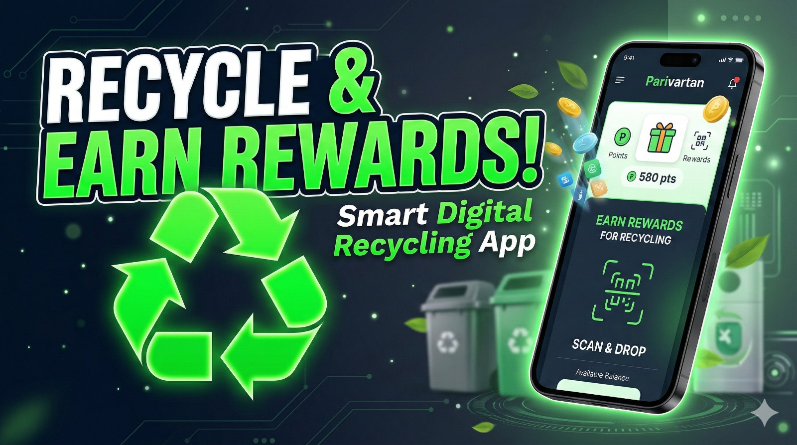

</a>

  

### 📽️ Project Video

Overview of Parivartan including the problem statement, solution, system architecture, key features, and project vision.

</td>

<td align="center" valign="top" width="50%">

<a href="https://drive.google.com/file/d/1TCyHnb3mfvnWh9pn3Wxe_5oVFuAiUL63/view?usp=sharing">

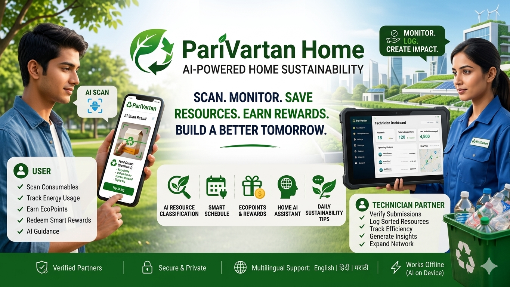

</a>

  

### 🎬 Demo Video

Complete working demonstration of Parivartan showcasing AI-powered waste identification, recycler connectivity, scheduled collections, rewards system, community engagement, and admin monitoring.

</td>

</tr>

</table>

---

# 📲 Download APK

<a href="https://github.com/ShraddhaPawar05/Parivartan/releases/download/v1.0.0/app-release.apk">

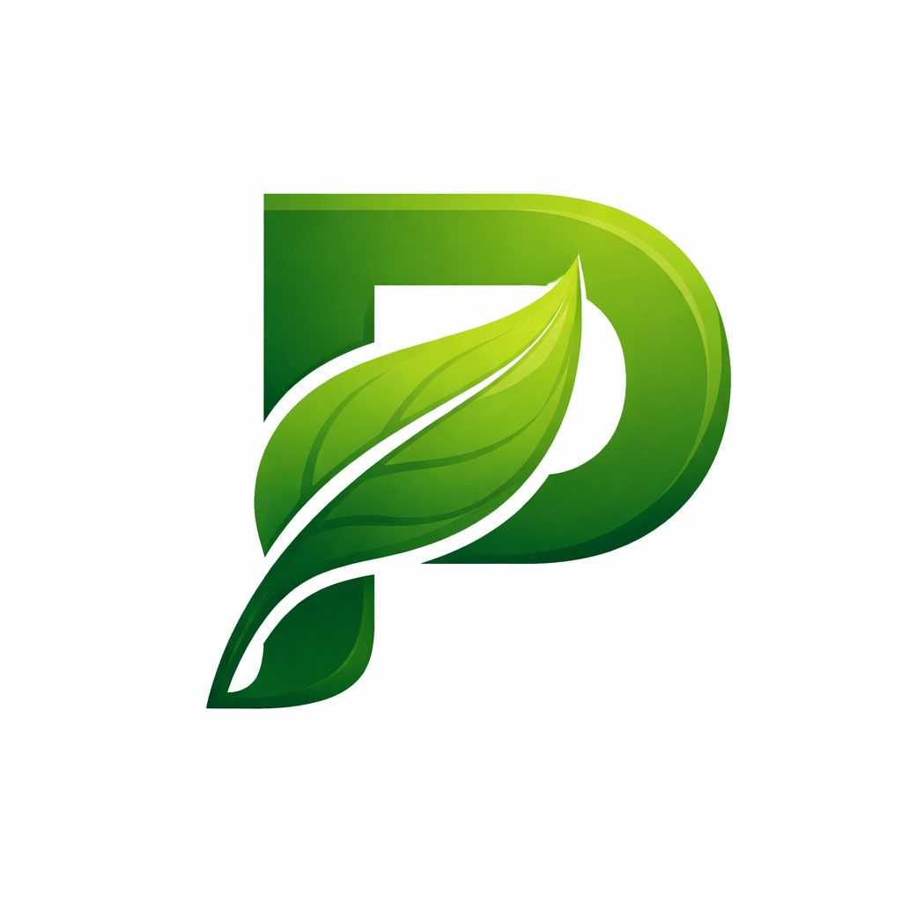

### Android Application

Download and experience the Parivartan mobile application.

---

# 🌐 Live Website

<a href="https://parivartan-3a3db.web.app/">

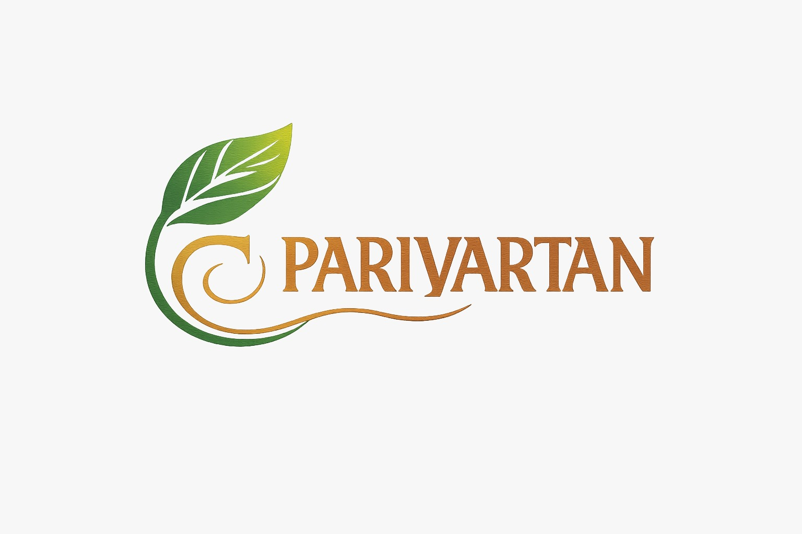

</a>

### Web Platform

Access the Parivartan web platform for administration, monitoring, and recycler management.

---

# 💻 GitHub Repository

### Source Code

This repository contains the complete source code, project documentation, system architecture, research findings, and implementation details of Parivartan.

The project demonstrates how AI and technology can be leveraged to improve waste segregation, recycling accessibility, and environmental sustainability.

---

# 👨‍💻 Team Aarambha

Parivartan is developed by Team Aarambha, a passionate team dedicated to building impactful and sustainable technology solutions.

Our vision is to create innovative platforms that empower communities, promote environmental responsibility, and contribute towards a cleaner and greener future.

---

# 🤝 Contributors

<table align="center">

<tr>

<td align="center">

  

### Shraddha Pawar

App Developer

</td>

<td align="center">

  

### Kishori Birari

Backend Developer

</td>

<td align="center">

  

### Alpana Pardesi

Web Developer

</td>

</tr>

</table>

---

# ❤️ Made with Passion by Team Aarambha

### 🌱 Transforming Waste into Opportunity Through Technology

Together, we aim to build a cleaner, greener, and more sustainable future through responsible waste management, recycling, and community participation.

---
